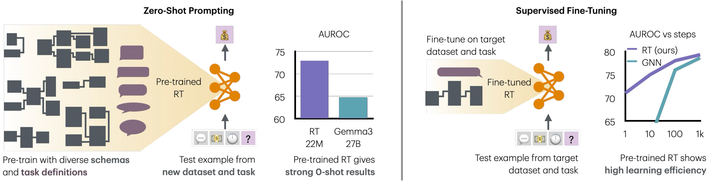
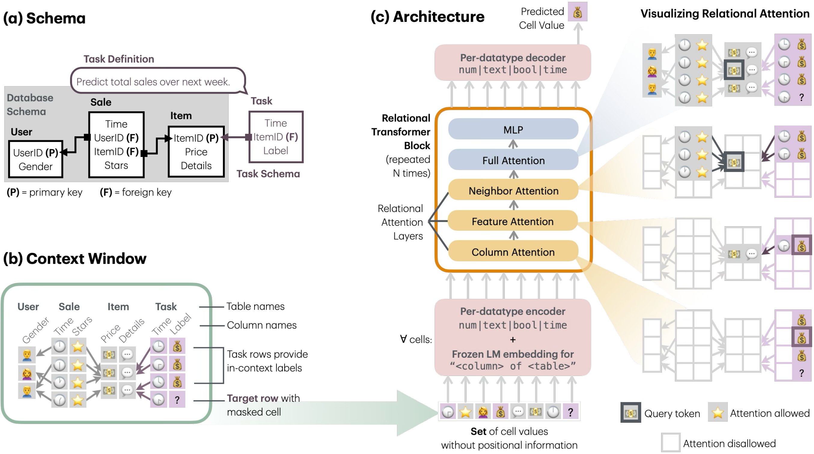

# Relational Transformer

This repository provides a reference implementation
of the Relational Transformer architecture
from the paper: [Relational Transformer: Toward Zero-Shot Foundation Models for Relational Data](https://arxiv.org/abs/2510.06377).

_🥇 Foundation Model Capabilities of Relational Transformer:_



_🤖 Overview of the Relational Transformer Architecture:_




## Installation

1. Install pixi [https://pixi.sh/latest/#installation](https://pixi.sh/latest/#installation).

2. Clone and install the repository:
```bash
git clone https://github.com/snap-stanford/relational-transformer
cd relational-transformer
pixi install
# compile and install the rust sampler
cd rustler
pixi run maturin develop --uv --release
```


## Data Preparation

1. Download the datasets and tasks from Relbench:
```bash
cd .. # back to the root of the repository
pixi run python scripts/download_relbench.py
```

2. Link the cache repository
```bash
mkdir ~/scratch
ln -s ~/.cache/relbench ~/scratch/relbench
```

3. Preprocessing (per database):
```bash
cd rustler
pixi run cargo run --release -- pre rel-f1
```

4. Text embedding (per database):

```bash
pixi run python -m rt.embed rel-f1
```

> [!NOTE]
> Steps 3. and 4. should be run for all databases: \
> `rel-amazon`, `rel-avito`, `rel-event`, `rel-f1`, `rel-hm`, `rel-stack`, `rel-trial`

## Download Preprocessed Data
This project’s preprocessed data is hosted at [hvag976/relational-transformer](https://huggingface.co/datasets/hvag976/relational-transformer/tree/main) on the Hugging Face Hub. You can directly use this data and skip the data preparation step.

1. Install the CLI
```bash
pip install -U huggingface_hub
```

2. Create the destination
```bash
mkdir -p ~/scratch/pre
```

3. Download the repository contents into ~/scratch/pre
```bash
huggingface-cli download hvag976/relational-transformer \
  --repo-type dataset \
  --local-dir ~/scratch/pre \
  --local-dir-use-symlinks False
```  

## Download Pretrained Checkpoints

This project's pretrained model checkpoints are hosted at [rishabh-ranjan/relational-transformer](https://huggingface.co/rishabh-ranjan/relational-transformer/tree/main) on the Hugging Face Hub. You can directly use these checkpoints and skip the pretraining step.

Two kinds of checkpoints are provided:
- `pretrain_<dataset>_<task>.pt`: pretrained with `<dataset>` held out.
- `contd-pretrain_<dataset>_<task>.pt`: obtained by continued pretraining of `pretrain_<dataset>_<task>.pt` on `<dataset>` with `<task>` held out.

To use, pass the checkpoint path to the `load_ckpt_path` argument of the training scripts.

1. Install the Hugging Face CLI (if not already installed):
```bash
pip install -U huggingface_hub
```

2. Download all checkpoints:
```bash
mkdir -p ~/scratch/rt_ckpts
huggingface-cli download rishabh-ranjan/relational-transformer \
  --repo-type model \
  --local-dir ~/scratch/rt_ckpts \
  --local-dir-use-symlinks False
```

3. Download a specific checkpoint:
```bash
mkdir -p ~/scratch/rt_ckpts
huggingface-cli download rishabh-ranjan/relational-transformer \
  --repo-type model \
  --include "pretrain_rel-amazon_user-churn.pt" \
  --local-dir ~/scratch/rt_ckpts \
  --local-dir-use-symlinks False
```


## Experiments

First setup `wandb` with `pixi run wandb login` or `pixi run wandb disabled`. The following example commands replicate the results for `rel-amazon/user-churn` from the paper.

* Pretrain on all datasets with `rel-amazon` held-out
(takes about 2 hours on 8xA100 GPUs):
```bash
pixi run torchrun --standalone --nproc_per_node=8 scripts/pretrain.py
```

* Continued pretrain
from best checkpoint obtained above
on all `rel-amazon` tasks
with `user-churn` held-out
(takes about 15 minutes on 8xA100 GPUs):
```bash
pixi run torchrun --standalone --nproc_per_node=8 scripts/contd_pretrain.py
```

* Finetune
from best checkpoint obtained above
on `rel-amazon/user-churn` task only
(takes about 1.5 hours on 8xA100 GPUs):
```bash
pixi run torchrun --standalone --nproc_per_node=8 scripts/finetune.py
```


## Citation

Please cite our paper:

```bibtex
@misc{ranjan2025relationaltransformer,
    title={Relational Transformer: Toward Zero-Shot Foundation Models for Relational Data}, 
    author={Rishabh Ranjan and Valter Hudovernik and Mark Znidar and Charilaos Kanatsoulis and Roshan Upendra and Mahmoud Mohammadi and Joe Meyer and Tom Palczewski and Carlos Guestrin and Jure Leskovec},
    year={2025},
    eprint={2510.06377},
    archivePrefix={arXiv},
    primaryClass={cs.LG},
    url={https://arxiv.org/abs/2510.06377}, 
}
```

